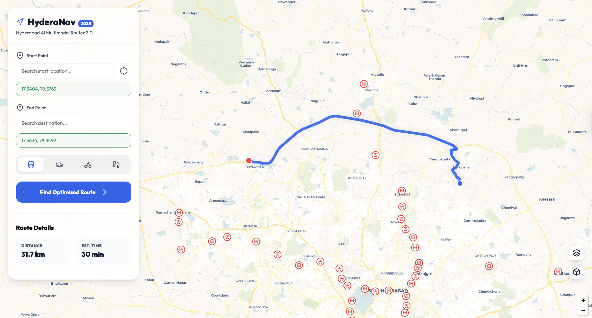
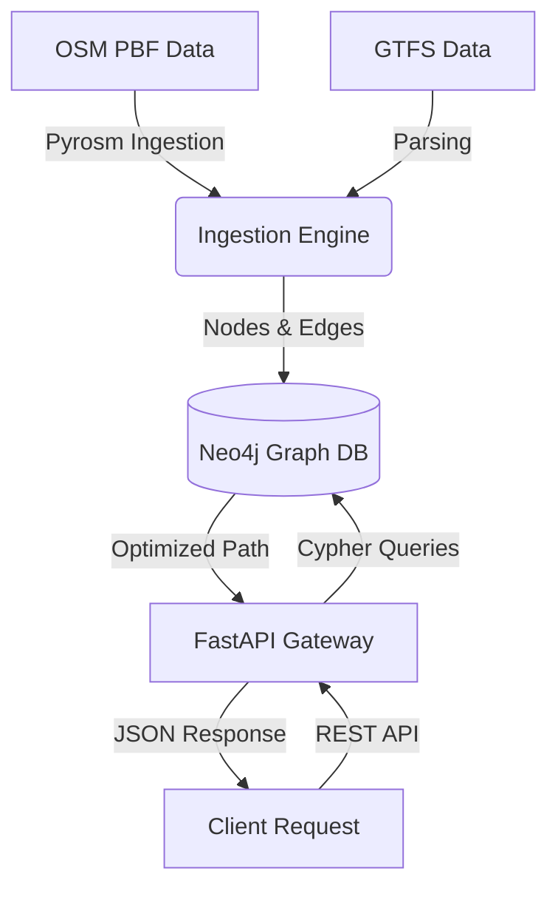

#  Multimodal Routing Engine




A state-of-the-art, high-performance routing infrastructure designed for next-gen transport networks. This engine synthesizes **OpenStreetMap (OSM)** and **GTFS** data into a unified, queryable knowledge graph, enabling sub-millisecond multimodal pathfinding and EV station discovery.

## Key Capabilities

*   **Multimodal Pathfinding**: Seamlessly routes between Walking, Transit, and Driving modes using A* heuristics over Neo4j.
*   **Billion-Scale Graph**: Optimized ingestion pipeline using `Pyrosm` and `Protobuf` for handling massive PBF/GTFS datasets.
*   **EV Infrastructure**: Integrated layers for Electric Vehicle charting and range estimation.
*   **Containerized Microservices**: Fully Dockerized architecture for "Write Once, Deploy Anywhere" scalability.
*   **Reactive UI**: Lightweight, glassmorphic frontend interface for real-time visualization.

## Architecture



## Tech Stack

| Component | Technology | Rationale |
| :--- | :--- | :--- |
| **Core API** | `FastAPI` | Asynchronous, high-throughput REST endpoints. |
| **Database** | `Neo4j` | Native graph storage for O(1) adjacency traversals. |
| **Ingestion** | `Pyrosm` | Rust-backed OSM parsing for maximum speed. |
| **Infra** | `Docker Compose` | Orchestrated container management. |

## Getting Started

### Prerequisites

*   Docker & Docker Compose
*   Python 3.10+ (for local dev)

### Deployment

1.  **Clone the repository**
    ```bash
    git clone https://github.com/your-org/routing-engine.git
    cd routing-engine
    ```

2.  **Start Services**
    ```bash
    docker-compose up -d --build
    ```

3.  **Access Endpoints**
    *   **UI:** `http://localhost:8000`
    *   **API Docs:** `http://localhost:8000/docs`
    *   **Neo4j Browser:** `http://localhost:7474`

## API Reference

### Find Route
`POST /route`

Retrieves the optimal path between two geocoordinates using the specified mode.

```json
{
  "start_lat": 12.9716,
  "start_lon": 77.5946,
  "end_lat": 12.9352,
  "end_lon": 77.6245,
  "mode": "transit"
}
```

### Get Stations
`GET /stations`

Returns all indexed transit stations with their real-time status.

## Development

To run locally without Docker:

```bash
pip install -r requirements.txt
uvicorn backend.main:app --reload
```


